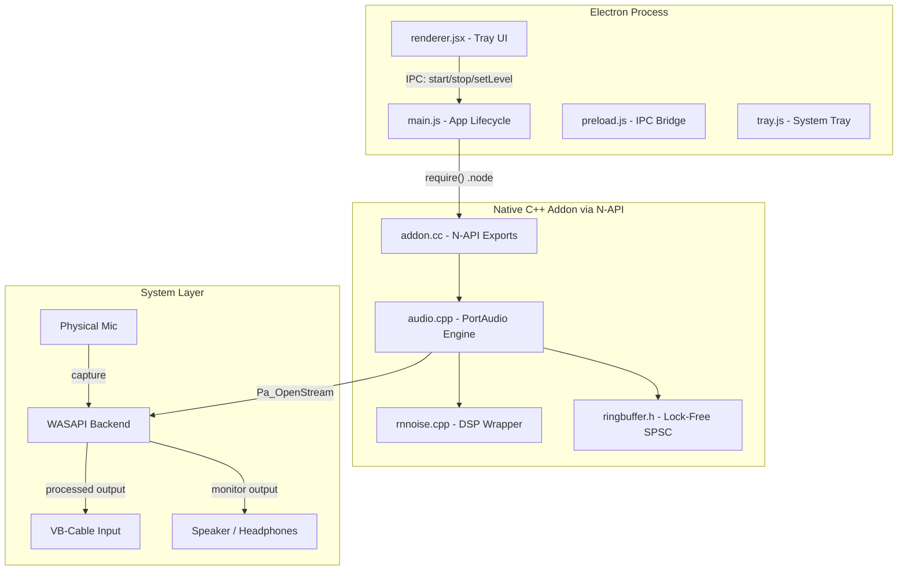
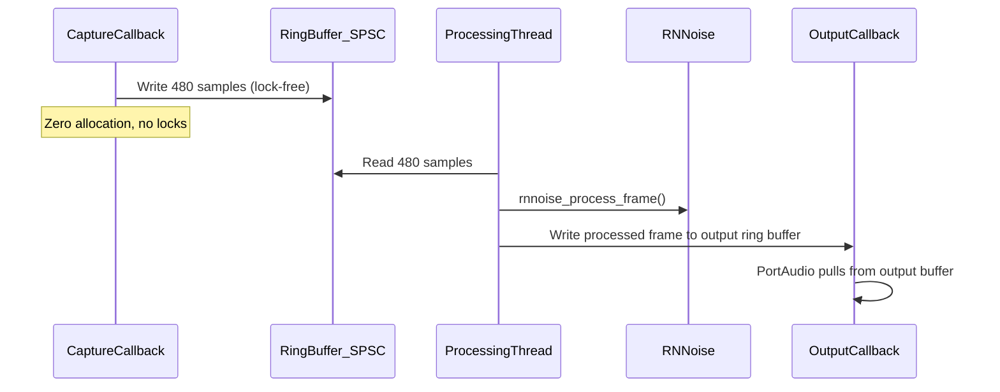

# NoiseGuard - Real-Time Noise Cancellation Starter

## Architecture Overview



## Audio Pipeline (Real-Time Thread)



## Folder Structure

```
noiseguard/
  electron/
    main.js          -- Electron main process, loads native addon, IPC handlers
    preload.js       -- contextBridge exposing safe IPC to renderer
    renderer.jsx     -- Minimal React-free UI (vanilla DOM), toggle + device list
    tray.js          -- System tray icon with ON/OFF context menu
    index.html       -- Simple HTML shell for renderer
  native/
    CMakeLists.txt   -- Build RNNoise as static lib (fetched via FetchContent)
    binding.gyp      -- node-gyp config linking PortAudio + RNNoise + addon
    src/
      addon.cc       -- N-API entry: start(), stop(), setNoiseLevel(), getDevices()
      audio.cpp/.h   -- AudioEngine class: PortAudio init, WASAPI config, callbacks
      rnnoise.cpp/.h -- RNNoise wrapper: init/destroy state, process_frame
      ringbuffer.h   -- Lock-free SPSC ring buffer (header-only, power-of-2 sizing)
  scripts/
    build-native.ps1 -- PowerShell: cmake build RNNoise, then node-gyp rebuild
  deps/              -- Will hold built PortAudio and RNNoise libs
  package.json
  README.md
```

## Key Implementation Details

### 1. Native Addon (`native/src/addon.cc`)

- Uses `node-addon-api` (C++ N-API wrapper) for clean binding
- Exports: `start(inputDeviceIdx, outputDeviceIdx)`, `stop()`, `setNoiseLevel(float 0.0-1.0)`, `getDevices()` returning `{inputs: [...], outputs: [...]}`
- `start()` creates the `AudioEngine` on a dedicated thread, returns a Promise
- `stop()` signals shutdown, joins thread, cleans up PortAudio streams

### 2. Audio Engine (`native/src/audio.cpp`)

- **Capture callback**: Writes raw float32 frames into SPSC ring buffer -- zero allocation, no locks, no syscalls
- **Processing thread**: Spins reading from capture ring buffer, runs RNNoise per 480-sample frame (10ms @ 48kHz), writes to output ring buffer
- **Output callback**: Reads from output ring buffer, writes to PortAudio output stream
- **WASAPI configuration**: Uses `PaWasapi_SetStreamCategory()` and attempts exclusive mode via `paWinWasapiExclusive` flag; falls back to shared mode if device is busy
- **Device disconnect handling**: Registers `PaStreamFinishedCallback`, detects `paDeviceUnavailable`, triggers auto-restart with exponential backoff
- **Shutdown**: Atomic `running_` flag, drain ring buffers, `Pa_CloseStream`, `Pa_Terminate`

### 3. Lock-Free Ring Buffer (`native/src/ringbuffer.h`)

- Single-Producer Single-Consumer (SPSC) design
- Power-of-2 capacity with bitwise masking
- `std::atomic<size_t>` for read/write indices with `memory_order_acquire`/`release`
- No allocations after construction
- Methods: `write(const float*, size_t)`, `read(float*, size_t)`, `available_read()`, `available_write()`

### 4. RNNoise Wrapper (`native/src/rnnoise.cpp`)

- Manages `DenoiseState`\* lifecycle
- `processFrame(float* frame)` -- processes exactly 480 samples in-place
- Noise level gating: multiplies RNNoise VAD output by user-controlled suppression level
- Thread-safe level update via `std::atomic<float>`

### 5. Electron Main (`electron/main.js`)

- Loads native addon via `require('../build/Release/noiseguard.node')`
- Registers IPC handlers: `audio:start`, `audio:stop`, `audio:set-level`, `audio:get-devices`
- Creates hidden `BrowserWindow` (no visible window, tray-only app)
- Clean shutdown via `app.on('before-quit')` calling `addon.stop()`

### 6. Tray UI (`electron/tray.js` + `electron/renderer.jsx`)

- System tray icon with context menu: Enable/Disable, Quit
- Renderer (loaded in hidden window): device selector dropdowns, noise suppression slider, latency placeholder, status indicator
- All UI is vanilla JS/HTML/CSS -- no React dependency to keep it minimal

### 7. Build System

`**binding.gyp` links against:

- Pre-built PortAudio (downloaded or built via CMake)
- Pre-built RNNoise static lib (built via CMakeLists.txt)
- Windows libs: `ole32.lib`, `winmm.lib`, `uuid.lib` (for WASAPI/COM)

`**scripts/build-native.ps1`:

1. Clone/fetch PortAudio and RNNoise into `deps/`
2. CMake configure + build both as static libs
3. Run `npx node-gyp rebuild` with correct include/lib paths
4. (Optional) Run `npx @electron/rebuild` for Electron ABI compatibility

`**package.json` scripts:

- `"build:native"` -- runs `build-native.ps1`
- `"rebuild:electron"` -- runs `@electron/rebuild`
- `"dev"` -- starts Electron app
- `"start"` -- production launch

### 8. Dependencies

| Package                 | Purpose                        |
| ----------------------- | ------------------------------ |
| `electron` (~v33)       | Desktop shell                  |
| `node-addon-api`        | C++ N-API wrapper              |
| `node-gyp`              | Native build tool              |
| `@electron/rebuild`     | Rebuild .node for Electron ABI |
| PortAudio (C, vendored) | Cross-platform audio I/O       |
| RNNoise (C, vendored)   | Neural noise suppression       |

### 9. VB-Cable Routing

The README will document:

1. Install VB-Cable from vb-audio.com
2. In NoiseGuard, select physical mic as input, "CABLE Input (VB-Audio)" as output
3. In target app (Discord/Zoom), select "CABLE Output (VB-Audio)" as microphone
4. This routes: Physical Mic -> NoiseGuard -> VB-Cable -> Target App

### 10. README Documentation

- ASCII architecture diagram
- Prerequisites (MSVC Build Tools 2022, CMake 3.20+, Node 20+, Python 3.x for node-gyp)
- Step-by-step build and run instructions
- VB-Cable routing guide
- TODO roadmap: DeepFilterNet integration, macOS/CoreAudio support, AGC/limiter, noise profiles/presets, installer packaging, latency measurement, GPU-accelerated inference

## Files To Create (18 files)

1. `package.json` -- project manifest with all dependencies and scripts
2. `README.md` -- full documentation with architecture, setup, usage
3. `electron/main.js` -- Electron main process
4. `electron/preload.js` -- context bridge for IPC
5. `electron/renderer.jsx` -- UI logic (vanilla JS despite .jsx extension; will rename to .js)
6. `electron/tray.js` -- tray icon and menu management
7. `electron/index.html` -- HTML shell
8. `electron/styles.css` -- minimal dark-theme CSS
9. `native/CMakeLists.txt` -- CMake for building RNNoise + PortAudio deps
10. `native/binding.gyp` -- node-gyp build configuration
11. `native/src/addon.cc` -- N-API addon entry point
12. `native/src/audio.cpp` -- PortAudio engine implementation
13. `native/src/audio.h` -- AudioEngine header
14. `native/src/rnnoise_wrapper.cpp` -- RNNoise wrapper implementation
15. `native/src/rnnoise_wrapper.h` -- RNNoise wrapper header
16. `native/src/ringbuffer.h` -- Lock-free SPSC ring buffer
17. `scripts/build-native.ps1` -- Windows build script
18. `.gitignore` -- standard ignores for node_modules, build, deps
